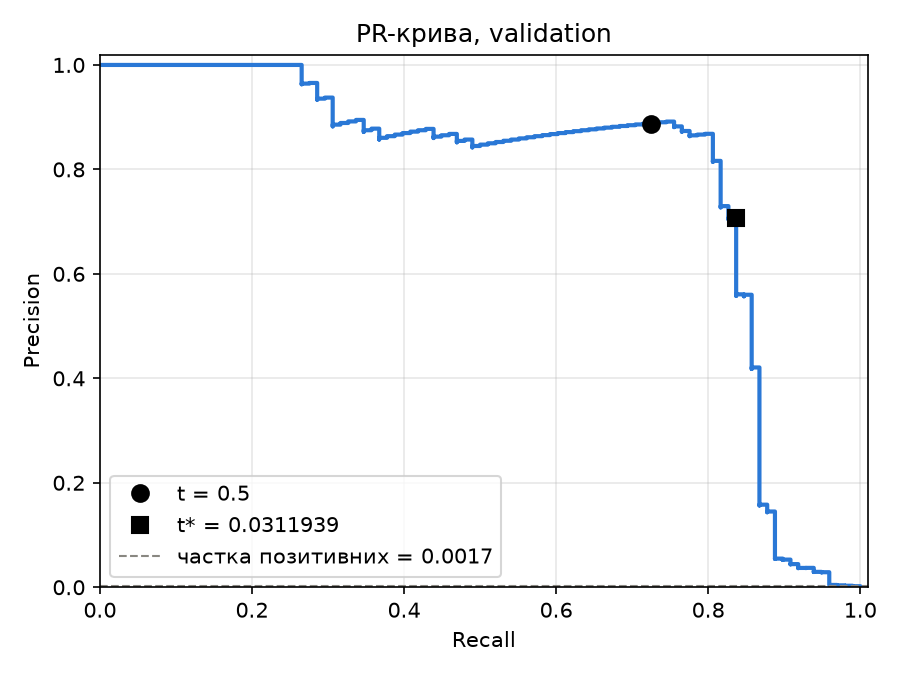
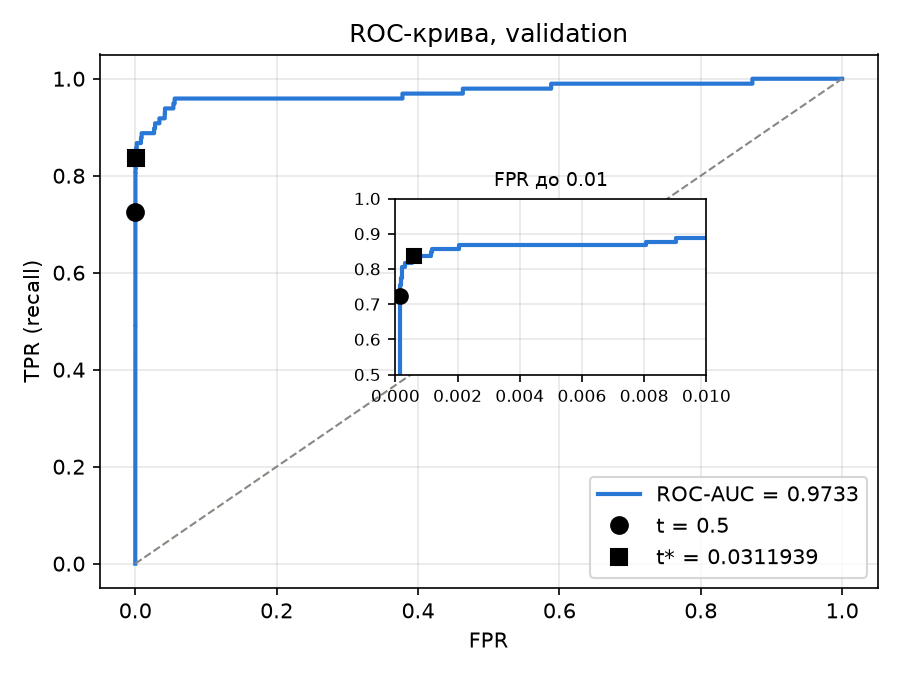

# ЛР2. Поріг рішення під асиметричну ціну помилок

Мережа `Linear(29, 32) -> ReLU -> Linear(32, 1)` на датасеті Credit Card Fraud Detection, навчена один раз за фіксованими налаштуваннями. На збережених прогнозах обирається поріг рішення, що мінімізує вартість помилок $C(t) = 10 \cdot FN(t) + FP(t)$. Коректність пошуку порога перевірено незалежним прямим перебором на трьох малих наборах, після чого зафіксований поріг застосовано до тестової вибірки.

## Структура теки

| Файл | Призначення |
|---|---|
| `lab2_starter.py` | стартовий код без змін: поділ, стандартизація, навчання, збереження прогнозів |
| `thresholds.py` | підрахунок $TP$, $FP$, $FN$, $TN$ і $C$; пошук порога через сортування й кумулятивні суми; незалежний прямий перебір |
| `analyze.py` | пункти 2–4: криві, ROC-AUC, таблиця кандидатів, перевірки A/B/C, тестова оцінка, розбір помилок |
| `pyproject.toml`, `uv.lock`, `.python-version` | версія Python 3.12 і зафіксовані версії залежностей |
| `results/` | ваги моделі `model.pt`; індекси поділу, мітки, `Amount` та оцінки (`predictions.npz`); статистики стандартизації; параметри запуску; журнал навчання |
| `analysis/` | криві, повна таблиця кандидатів, підсумкова таблиця, перевірки A/B/C, тестова оцінка, таблиця помилок |

## Відтворення результатів

Датасет: [Credit Card Fraud Detection, Kaggle](https://www.kaggle.com/datasets/mlg-ulb/creditcardfraud). Файл `creditcard.csv` до репозиторію не додається; шлях до нього передається параметром `--data`.

Встановлення залежностей:

```
uv sync
```

Аналіз зі збережених прогнозів (пункти 2–4) — не потребує ні навчання, ні вихідного CSV:

```
uv run python analyze.py --saved results --out analysis
```

Повторне навчання з локального CSV. Оскільки стартовий код не перезаписує непорожню теку, для повторного запуску слід вказати нову:

```
uv run python lab2_starter.py --data /шлях/до/creditcard.csv --out results_rerun
```

Усі числа, наведені у звіті, отримано з прогнозів у `results/`. Повторне навчання відтворює той самий поділ і ті самі статистики стандартизації, що було перевірено побітовим порівнянням із `results/predictions.npz` і `results/preprocessing.npz`. Оцінки моделі при цьому можуть відрізнятися в молодших розрядах залежно від версії PyTorch і платформи.

## 1. Дані, поділ і навчання

Як вхідні ознаки використано 29 стовпців: `V1`–`V28` і `Amount`. Стовпці `Class` і `Time` на вхід моделі не подаються; сире значення `Amount` зберігається окремо й використовується лише під час аналізу помилок.

Поділ у співвідношенні 60/20/20 є стратифікованим за `Class` і виконується над індексами рядків CSV у їхньому початковому порядку. Спочатку `train_test_split` з параметрами `test_size=0.4`, `random_state=0` відокремлює навчальну вибірку; далі відкладені індекси діляться навпіл (`test_size=0.5`, стратифікація за відповідними мітками, `random_state=0`), причому перша частина утворює validation, а друга — test.

| Вибірка | Кількість обʼєктів | Шахрайських | Частка шахрайських |
|---|---|---|---|
| train | 170 884 | 295 | 0.1726% |
| validation | 56 961 | 98 | 0.1720% |
| test | 56 962 | 99 | 0.1738% |

Завдяки стратифікації частка шахрайських транзакцій в усіх трьох вибірках становить близько 0.17%, тобто приблизно одна шахрайська транзакція на 580 легітимних.

Ознаки стандартизуються за допомогою `StandardScaler`, навченого виключно на train; ті самі середні значення та стандартні відхилення застосовуються до validation і test. Обчислювати ці статистики на всьому наборі некоректно, оскільки тоді середнє та дисперсія містили б інформацію про validation і test. У такому разі модель і поріг опосередковано налаштовувалися б на даних, які мають імітувати нові, раніше не бачені транзакції, і оцінки якості на них виявилися б оптимістично зміщеними. Крім того, у реальному застосуванні статистики майбутніх транзакцій на момент навчання моделі невідомі.

Навчання виконано один раз стартовим кодом з такими налаштуваннями: функція втрат `BCEWithLogitsLoss` без зважування класів, оптимізатор Adam зі швидкістю навчання $10^{-3}$, 12 епох, розмір пакета 1024, обчислення на CPU у `float32`, `torch.manual_seed(0)`, перемішування навчальної вибірки окремим генератором `np.random.default_rng(0)` на кожній епосі. Використано ваги після 12-ї епохи. Середнє значення BCE на train за епоху зменшилося з 0.3653 до 0.003383 (`results/train_log.txt`). Оцінки $s_i = \sigma(z_i)$, де $z_i$ — вихідний логіт, для validation і test отримано в режимі `eval()` без обчислення градієнтів і збережено без округлення.

## 2. Вибір порога на validation

### Метрики та вартість помилок

Для порога $t$ транзакція класифікується як шахрайська, якщо $s_i \ge t$. Відповідно,

$$TP(t) = \left|\lbrace i : s_i \ge t,\ y_i = 1 \rbrace\right|, \qquad FP(t) = \left|\lbrace i : s_i \ge t,\ y_i = 0 \rbrace\right|,$$

$$FN(t) = \left|\lbrace i : s_i < t,\ y_i = 1 \rbrace\right|, \qquad TN(t) = \left|\lbrace i : s_i < t,\ y_i = 0 \rbrace\right|,$$

$$C(t) = 10 \cdot FN(t) + FP(t).$$

Тут $FN$ — пропущене шахрайство, $FP$ — хибна тривога; пропуск шахрайства вважається вдесятеро дорожчим. Значення `Amount` у формулу вартості не входить. Для аналізу також використовуються

$$\text{precision} = \frac{TP}{TP + FP}, \qquad \text{recall} = \frac{TP}{TP + FN}, \qquad \text{FPR} = \frac{FP}{FP + TN}.$$

### Криві та ROC-AUC





ROC-AUC на validation становить **0.9733**. На обох кривих позначено пороги $t = 0.5$ і $t^{\ast}$; на ROC-кривій додатково збільшено ділянку $\text{FPR} \le 0.01$, у якій розташовані обидва пороги.

Висока ROC-AUC не гарантує ні малої вартості помилок, ні високої точності. На це можна вказати три причини.

1. ROC-AUC дорівнює ймовірності того, що випадково обрана шахрайська транзакція отримає вищу оцінку, ніж випадково обрана легітимна. Ця величина усереднює якість ранжування за всіма порогами і не залежить від того, який поріг обрано. Натомість вартість обчислюється для одного конкретного порога: за незмінної ROC-AUC = 0.9733 поріг $0.5$ дає $C = 279$, поріг $t^{\ast}$ — $C = 194$, а поріг $+\infty$ — $C = 980$.
2. FPR нормується на кількість легітимних транзакцій, яких у validation 56 863. Тому навіть 34 хибні тривоги дають $\text{FPR} \approx 0.0006$, і на ROC-кривій відповідна точка виглядає майже ідеальною. Precision натомість нормується на кількість спрацювань: для $t^{\ast}$ маємо $82 / (82 + 34) \approx 0.707$, тобто приблизно кожна третя тривога є хибною. За дисбалансу класів близько $1:580$ навіть малий FPR відповідає помітній кількості $FP$ порівняно з рідкісними позитивними обʼєктами.
3. ROC-AUC не враховує асиметрію ціни помилок: для неї $FP$ і $FN$ рівноцінні, тоді як у $C(t)$ пропуск коштує 10.

PR-крива відображає ці ефекти безпосередньо: базовий рівень precision випадкового класифікатора дорівнює частці позитивних, $\approx 0.0017$, а точка, що відповідає $t^{\ast}$, лежить на ділянці крутого спаду кривої.

### Алгоритм пошуку порога

Множина кандидатів складається з усіх унікальних оцінок validation і $+\infty$. Поріг $+\infty$ відповідає правилу «усі негативні», найменша оцінка — правилу «усі позитивні». Пошук виконується за $O(n \log n)$, де $n = 56\,961$ (функція `thresholds.threshold_table`):

1. Оцінки сортуються за спаданням (`np.argsort(-s, kind="stable")`), мітки переставляються відповідно.
2. Кумулятивні суми `cumsum(y == 1)` і `cumsum(y == 0)` дають кількість позитивних і негативних обʼєктів серед $k$ найбільших оцінок.
3. Для кожної групи рівних оцінок береться останній індекс групи: при $t$, що дорівнює цій оцінці, правило $s_i \ge t$ охоплює всю групу, тож рівні оцінки гарантовано отримують однаковий прогноз. Значення кумулятивних сум у цій точці дорівнюють $TP(t)$ і $FP(t)$.
4. Для $+\infty$ додається рядок $TP = FP = 0$. Далі для всіх кандидатів одночасно обчислюються $FN = P - TP$, $TN = N - FP$ і $C = 10 \cdot FN + FP$, де $P$ і $N$ — кількість позитивних і негативних обʼєктів.
5. Якщо мінімум $C$ досягається на кількох порогах, обирається найбільший із них (`thresholds.best_threshold`).

Таким чином, вибірка обробляється один раз, а не окремо для кожного порога. Серед 56 961 оцінки validation унікальних 55 979, тобто 982 оцінки повторюються, отже коректна обробка рівних оцінок має значення і на реальних даних. Разом із $+\infty$ маємо 55 980 кандидатів; повну таблицю збережено у `analysis/validation_thresholds.csv` з повною точністю порогів.

Мінімум $C = 194$ досягається на єдиному порозі $t^{\ast} = 0.031193900853395462$. Найближчі за вартістю пороги: $0.030646$ ($C = 195$), $0.030446$ ($C = 196$), $0.029957$ ($C = 197$), а також $0.045355$ і $0.029551$ (обидва з $C = 198$).

| Правило на validation | Поріг | TP | FP | FN | TN | C |
|---|---|---|---|---|---|---|
| Стандартний поріг | $0.5$ | 71 | 9 | 27 | 56 854 | 279 |
| Мінімум вартості | $t^{\ast} \approx 0.031194$ | 82 | 34 | 16 | 56 829 | 194 |
| Усі негативні | $+\infty$ | 0 | 0 | 98 | 56 863 | 980 |

Порівняно з порогом $0.5$ поріг $t^{\ast}$ дозволяє виявити на 11 шахрайських транзакцій більше ($FN$: $27 \to 16$) ціною 25 додаткових хибних тривог ($FP$: $9 \to 34$). З огляду на ціну пропуску це вигідно: $10 \cdot 11 = 110 > 25$, і вартість зменшується на 85. Поріг $+\infty$ ілюструє вартість відмови від моделі: пропуск усіх 98 шахрайських транзакцій коштує 980.

## 3. Перевірка реалізації пошуку порога

Для кожного контрольного набору той самий список кандидатів (унікальні оцінки та $+\infty$) будується окремо, і для кожного кандидата матриця плутанини обчислюється прямим застосуванням правила $s_i \ge t$ у звичайному циклі по елементах (`thresholds.brute_force_table`). Вибір порога в перевірочній реалізації також виконано незалежно (`thresholds.brute_force_best`): рядки перебираються послідовно, і поточний найкращий кандидат замінюється, якщо вартість менша або рівна за більшого порога. Перевірочний код не використовує результатів швидкого алгоритму. Результати порівнюються з `threshold_table` і `best_threshold`: усі лічильники й вартості мають збігатися точно, а обраний поріг — бути тим самим.

**Набір A.** $s = [0.9,\ 0.7,\ 0.7,\ 0.4,\ 0.2,\ 0.1]$, $y = [0,\ 1,\ 0,\ 1,\ 0,\ 0]$.

| Поріг | TP | FP | FN | TN | C |
|---|---|---|---|---|---|
| $+\infty$ | 0 | 0 | 2 | 4 | 20 |
| $0.9$ | 0 | 1 | 2 | 3 | 21 |
| $0.7$ | 1 | 2 | 1 | 2 | 12 |
| $0.4$ | 2 | 2 | 0 | 2 | **2** |
| $0.2$ | 2 | 3 | 0 | 1 | 3 |
| $0.1$ | 2 | 4 | 0 | 0 | 4 |

Обидві реалізації обирають поріг $0.4$. Дві оцінки $0.7$ мають різні мітки (1 і 0) і утворюють одного кандидата: при $t = 0.7$ обидві стають позитивними одночасно, тому $TP$ і $FP$ зростають разом (до 1 і 2 відповідно). Якби рівні оцінки розглядалися окремо, виник би неприпустимий проміжний стан, у якому позитивною є лише одна з двох однакових оцінок.

**Набір B.** $s = [0.9,\ 0.6,\ 0.3]$, $y = [0,\ 0,\ 0]$.

| Поріг | TP | FP | FN | TN | C |
|---|---|---|---|---|---|
| $+\infty$ | 0 | 0 | 0 | 3 | **0** |
| $0.9$ | 0 | 1 | 0 | 2 | 1 |
| $0.6$ | 0 | 2 | 0 | 1 | 2 |
| $0.3$ | 0 | 3 | 0 | 0 | 3 |

Обидві реалізації обирають поріг $+\infty$. Набір перевіряє граничний випадок без позитивних міток: $FN$ завжди дорівнює нулю, будь-яке спрацювання є хибною тривогою, тому оптимальним є рішення ніколи не спрацьовувати. Кандидат $+\infty$ обовʼязково має входити до списку, інакше найкращим виявився б поріг $0.9$ з $C = 1$. У цьому наборі $\text{recall} = TP / (TP + FN) = 0/0$ не визначений для жодного порога, оскільки позитивних обʼєктів немає, а при $t = +\infty$ не визначена й $\text{precision} = 0/0$, бо немає жодного спрацювання. Пошук за вартістю при цьому працює коректно, оскільки $C$ від цих відношень не залежить.

**Набір C.** $s = [0.8,\ \underbrace{0.5,\ \ldots,\ 0.5}_{11},\ 0.2]$, $y = [1,\ 1,\ \underbrace{0,\ \ldots,\ 0}_{10},\ 0]$: серед одинадцяти оцінок $0.5$ перша має мітку 1, решта десять — мітку 0.

| Поріг | TP | FP | FN | TN | C |
|---|---|---|---|---|---|
| $+\infty$ | 0 | 0 | 2 | 11 | 20 |
| $0.8$ | 1 | 0 | 1 | 11 | **10** |
| $0.5$ | 2 | 10 | 0 | 1 | **10** |
| $0.2$ | 2 | 11 | 0 | 0 | 11 |

Обидві реалізації обирають поріг $0.8$. Цей набір перевіряє одразу дві властивості. По-перше, мінімальна вартість $C = 10$ досягається на двох порогах, і правило розвʼязання нічиєї має обрати більший із них, тобто $0.8$. По-друге, одинадцять рівних оцінок $0.5$ з мітками $1, 0, \ldots, 0$ мають оброблятися як одна група: якби лічильники помилково бралися на першому елементі групи, виник би стан $TP = 2$, $FP = 0$, $C = 0$, якого жоден поріг насправді не дає.

Усі три перевірки пройдено: таблиці збігаються точно, обрані пороги однакові (`analysis/checks_summary.csv`, `analysis/check_A.csv`, `check_B.csv`, `check_C.csv`). Тестова оцінка виконується лише після цього: якщо хоча б одна перевірка не пройдена, `analyze.py` завершує роботу, не переходячи до test.

## 4. Тестова оцінка та аналіз помилок

Поріг $t^{\ast} = 0.031193900853395462$, зафіксований на validation, без змін застосовано до тестової вибірки. Результати test не використовувалися для зміни порога, моделі чи налаштувань навчання.

| | Прогноз: шахрайство | Прогноз: легітимна |
|---|---|---|
| **Шахрайство** (99) | $TP = 80$ | $FN = 19$ |
| **Легітимна** (56 863) | $FP = 43$ | $TN = 56\,820$ |

$$C = 10 \cdot 19 + 43 = 233, \qquad \text{precision} = \frac{80}{123} \approx 0.650, \qquad \text{recall} = \frac{80}{99} \approx 0.808.$$

Для тестової вибірки обидві метрики визначені. Precision не визначена у випадку $TP + FP = 0$, тобто коли модель не видає жодного спрацювання (наприклад, при $t = +\infty$): частку правильних серед спрацювань неможливо обчислити, якщо спрацювань немає. Recall не визначена у випадку $TP + FN = 0$, тобто коли у вибірці немає жодного позитивного обʼєкта, як у наборі B.

### Перші пʼять хибнопозитивних і хибнонегативних прикладів на test

Приклади впорядковано за номером рядка CSV (нумерація від 0, без заголовка). Оцінки округлено лише для відображення; повні значення наведено в `analysis/test_errors.csv`.

| Рядок CSV | Тип помилки | Мітка | Оцінка $s$ | Amount | $s - t^{\ast}$ |
|---|---|---|---|---|---|
| 460 | FP | 0 | 0.1962 | 2.00 | +0.1650 |
| 2961 | FP | 0 | 0.0810 | 2.49 | +0.0498 |
| 10783 | FP | 0 | 0.9663 | 89.99 | +0.9351 |
| 13405 | FP | 0 | 0.9320 | 89.99 | +0.9008 |
| 13617 | FP | 0 | 0.9228 | 89.99 | +0.8916 |
| 10497 | FN | 1 | 0.0115 | 3.79 | −0.0197 |
| 52521 | FN | 1 | 0.0064 | 105.99 | −0.0248 |
| 55401 | FN | 1 | 0.0056 | 1.00 | −0.0256 |
| 91671 | FN | 1 | 0.0005 | 290.18 | −0.0307 |
| 93486 | FN | 1 | 0.0184 | 0.00 | −0.0128 |

Сирі значення `Amount` в обох групах різнорідні: серед FP трапляються суми 2.00 і 2.49, а також три однакові суми 89.99; серед FN суми лежать у діапазоні від 0.00 до 290.18. Чіткої відмінності між FP і FN за `Amount` у цих прикладах не спостерігається.

Відстань оцінок від порога для двох типів помилок суттєво різниться. Три з пʼяти FP мають оцінки 0.92–0.97, тобто модель помиляється впевнено і далеко від будь-якого розумного порога; зсув порога такі помилки не виправить. Ці три FP мають однакову суму 89.99 і близькі номери рядків, що може свідчити про схожі транзакції, які модель сприймає як шахрайські. Натомість усі FN мають оцінки 0.0005–0.018: в абсолютних величинах вони лежать лише на 0.013–0.031 нижче $t^{\ast}$, однак відносно самого порога є в 1.7–62 рази меншими за нього. Щоб виявити такі транзакції, поріг довелося б знизити в рази, що спричинило б значне зростання кількості хибних тривог.

Робити висновки про причини помилок моделі лише за десятьма прикладами некоректно. Вибірка мала й невипадкова: це перші помилки за номером рядка, а не типові. Для обґрунтованого висновку необхідно розглянути всі 62 помилки на test і порівняти розподіли `Amount` та оцінок із відповідними розподілами для правильно класифікованих транзакцій. Крім того, ознаки `V1`–`V28` є анонімізованими компонентами PCA, тому їхня змістовна інтерпретація неможлива. Розглянуті приклади можуть лише підказати гіпотези для подальшої перевірки — наприклад, щодо повторюваної суми 89.99 серед впевнених FP.

## Висновки

1. **Що змінив вибір порога.** Модель і її оцінки залишилися незмінними; змінилося лише правило, за яким оцінка перетворюється на рішення. Оптимальний поріг $t^{\ast} \approx 0.031$ значно нижчий за стандартний $0.5$: оскільки пропуск шахрайства вдесятеро дорожчий за хибну тривогу, спрацювання виявляється вигідним навіть за невеликої оцінки. На validation вартість помилок зменшилася з 279 до 194.
2. **Ціна рішення.** На validation поріг $t^{\ast}$ дозволив виявити на 11 шахрайських транзакцій більше ($FN$: $27 \to 16$) ціною 25 додаткових хибних тривог ($FP$: $9 \to 34$). Precision при цьому знизилася з 0.888 до 0.707, а recall зросла з 0.724 до 0.837. На test при $t^{\ast}$ отримано $FN = 19$, $FP = 43$, $C = 233$.
3. **Чому результат на validation не гарантує такого самого виграшу на test.** Поріг $t^{\ast}$ обрано як мінімум вартості саме на validation, тобто він частково підлаштований під конкретні 98 шахрайських транзакцій цієї вибірки, і мінімальне значення вартості на ній є оптимістично зміщеним. Шахрайських транзакцій мало, тому вартість дуже чутлива до окремих обʼєктів: один додатковий пропуск змінює $C$ на 10. Крім того, мінімум пологий: пороги 0.0306, 0.0304, 0.0300, 0.0454 і 0.0296 дають $C = 195$–$198$, тож вибір між ними визначається кількома конкретними обʼєктами. На test вартість (233) виявилася вищою, ніж на validation (194): 19 пропусків замість 16 і 43 хибні тривоги замість 34. Така різниця є очікуваним розкидом між двома незалежними вибірками такого розміру, а не ознакою помилки. Для оцінки стабільності виграшу від $t^{\ast}$ доцільно побудувати довірчі інтервали (наприклад, методом бутстрепу) або використати більшу кількість позитивних прикладів.

## Джерела

- Матеріали лекцій 3–4 курсу (бінарна класифікація, BCE, матриця плутанини, precision і recall, ROC- і PR-криві, вибір порога з урахуванням ціни помилок)
- Стартовий код викладача `lab2_starter.py` (поділ, стандартизація, модель, цикл навчання, збереження прогнозів)
- Документація scikit-learn: `train_test_split`, `StandardScaler`, `roc_curve`, `roc_auc_score`, `precision_recall_curve`
- Документація NumPy (`argsort`, `cumsum`) і PyTorch (`BCEWithLogitsLoss`, `torch.optim.Adam`)
- Датасет: Machine Learning Group, ULB. Credit Card Fraud Detection. Kaggle: https://www.kaggle.com/datasets/mlg-ulb/creditcardfraud
- Генеративний асистент Claude (Anthropic) використано як допоміжний інструмент під час написання коду та оформлення звіту; усі формули, результати й перевірки відтворюються наведеними командами
